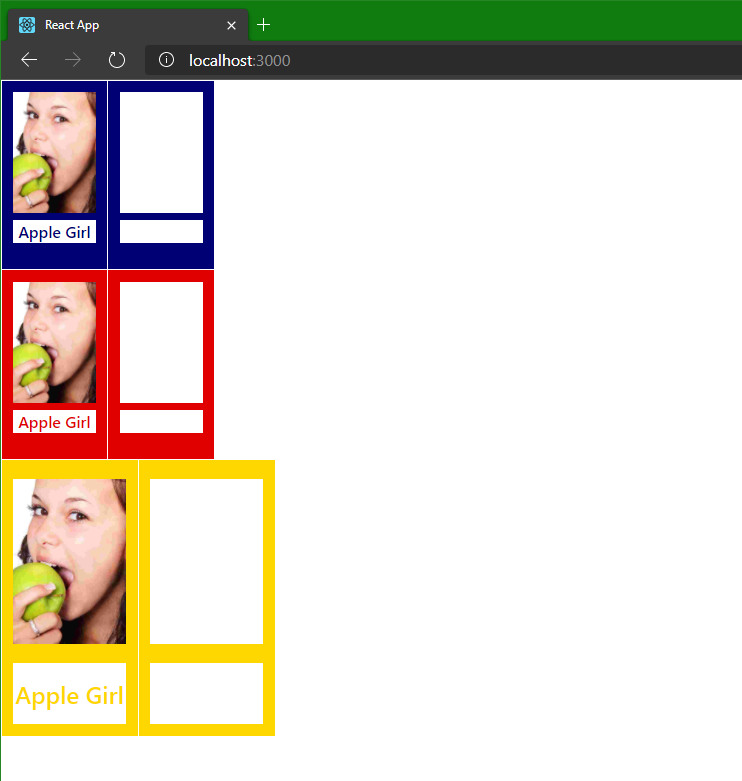

# Custom Guess Who game

Generate cards ready to be printed out and used in a Guess Who game. Simply provide images, and the code does the rest!

## Features

- Use your own digital images and print out ready to play with cards.
- Create blank cards you can glue on images and write names after printing.

## Steps to create a custom Guess Who game

Follow these steps to create your own custom guess who game!

1. Buy a copy of the game [Guess Who?](https://en.wikipedia.org/wiki/Guess_Who%3F)
2. Find 24 images of someone you want to have in your game.
3. For the best result you want to cut the images to the person's head.
   - Tip: Cropping can be done in many applications, like the built in Photos app in Windows. A free app that supports setting the aspect ratio when cropping is [GIMP](https://www.gimp.org/).
   - *(Optional)* To avoid white stripes on the sides of the image (to fill the image field in the card) use the ratio `22:32` when cutting.
4. Name the image files the name of the persons.
   - For a blank name use "blank_name" somewhere in the file name. You can use "blank_name1", "blank_name2", etc. for as many blank names as you want.
5. Clone this repository and run the web app with `npm start`
6. Add the images to the folder `/src/faces`
7. Print the resulting web page from your browser (CTRL + P)
   - In Chrome in the print dialog, choose "More settings" and check the checkbox "Background graphics".
   - Tip: the cards will work best if they are stiffer than regular printer paper. To achieve this you can use a thicker paper, photopaper or laminating the printer paper. You can also simply glue printer paper onto thicker paper if your printer cannot print it.
8. Cut out the cards and play with them!

## Will this work for me

You should double check that the sizes of the cards matches the sizes of your game. Sizes hard coded in this repo are:

- Face card: 50mm (height) x 28mm (width)
- Secret card: 73mm (height) x 36mm (width)

You can change the sizes by changing the CSS inside the components `FaceCard.js` and `SecretCard.js`. The card colours are defined in `App.css`.

Currently the code are written to find the file extensions .png, .jpg and .svg. The [limitation is your browser](https://developer.mozilla.org/en-US/docs/Web/HTML/Element/img#Supported_image_formats), so it should be possible to modify the code and use any file format your browser support.

The print feature of your browser could mess with the scaling. Printing a test page and measuring the cards is adviced.

## Quirks

Since CSS doesn't support page breaks inside Flexbox or CSS Grid it is hard coded that there are four pages. One for player 1 face cards (with blue colours), one for player 2 face cards (with red colours), and two pages for the secret cards (with yellow colours).

## Dev stuff

This project was bootstrapped with [Create React App](https://github.com/facebook/create-react-app).

Uses styled-components to put CSS in JS (the components).

### Available Scripts

In the project directory, you can run:

### `npm start`

Runs the app in the development mode.

Open [http://localhost:3000](http://localhost:3000) to view it in the browser.

The page will reload if you make edits.

You will also see any lint errors in the console.
